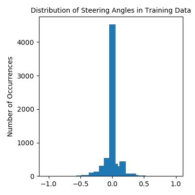
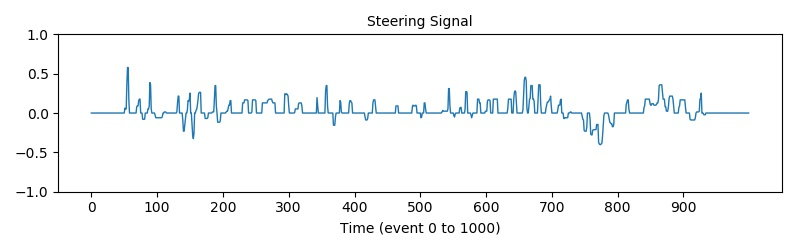
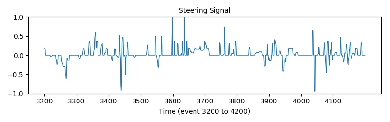
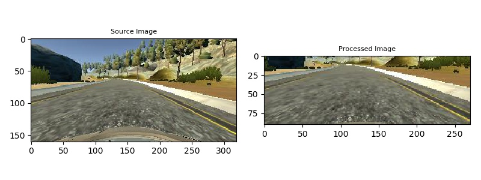
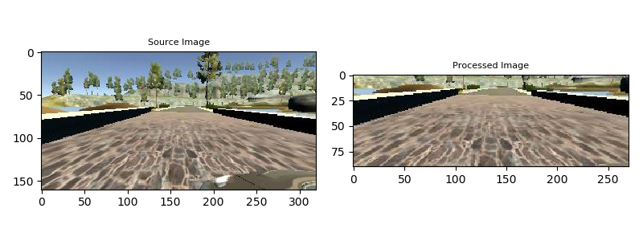
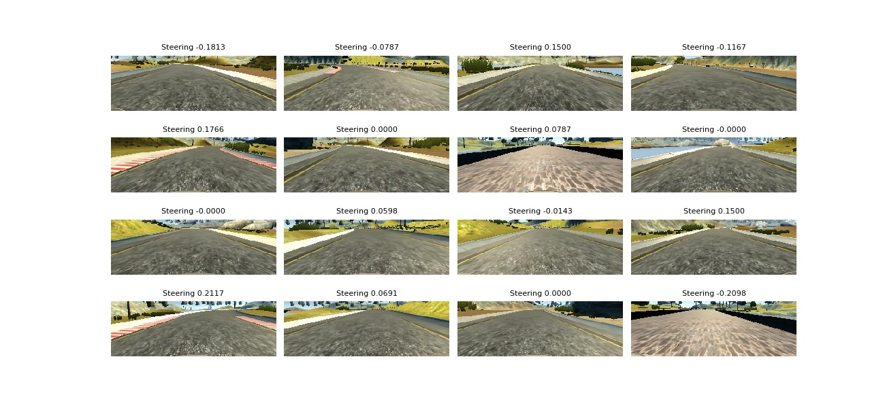

## Behaviorial Cloning Project

[](http://www.udacity.com/drive)

Overview - Udacity Self Driving Car Term 1 Project 3
----------------------------------------------------

The goals / steps of this project are the following:
* Use the simulator to collect data of good driving behavior
* Build, a convolution neural network in Keras that predicts steering angles from images
* Train and validate the model with a training and validation set
* Use the model to drive the vehicle autonomously around the first track in the simulator. The vehicle should remain on the road for an entire loop around the track
* Summarize the results with a written report

### Dependencies

#### Environment

* [CarND Term1 Starter Kit](https://github.com/udacity/CarND-Term1-Starter-Kit)

The environment to run this can be created with CarND Term1 Starter Kit. Click [here](https://github.com/udacity/CarND-Term1-Starter-Kit/blob/master/README.md) for the details.

Additional tools needed for model visualization are graphviz, pydot-ng. If model visualization is not needed comment out `plot(model, to_file='static/model.png', show_shapes=True)` in `train.py`. There can be installed as
```
brew install graphviz  # apt-get install graphviz for debian derivaties
source activate carnd-term1
pip install pydot-ng
conda install graphviz
```

#### Simulator

The Simulator used to train and test the car around track can be downloaded from:

* [Linux](https://d17h27t6h515a5.cloudfront.net/topher/2017/February/58ae46bb_linux-sim/linux-sim.zip)
* [Windows](https://d17h27t6h515a5.cloudfront.net/topher/2017/February/58ae4594_mac-sim.app/mac-sim.app.zip)
* [macOS](https://d17h27t6h515a5.cloudfront.net/topher/2017/February/58ae4419_windows-sim/windows-sim.zip)
* [Source](https://github.com/udacity/self-driving-car-sim)

NOTES* 
On Windows 8 there is an issue where drive.py is unable to establish a data connection with the simulator. If you are running Windows 8 It is advised to upgrade to Windows 10, which should be free, and then you should be able to run the project properly.
On macOS X the mac_sim.app wont run even if the Security Settings are changes. In order to run the file. "Control" click the mac_sim.app icon and select "Open" and then grant permissions to the file. This will make a permanent rule on the system

### Method

Deep neural networks and convolutional neural networks to clone driving behavior using Keras. The model will output a steering angle to an autonomous vehicle which is also run in the Simulator. The model is based on the NVidia paper https://arxiv.org/pdf/1604.07316v1.pdf

### Details About Files In This Directory

##### `sample_data/`

Sample Driving data is NOT included in the repo. This can be downloaded from https://d17h27t6h515a5.cloudfront.net/topher/2016/December/584f6edd_data/data.zip
Download this data into the sample_data directory.

##### `collected_data/`

Save the data collected while driving the car in the simulator here. It is hard to collect good data without a joystick so best to go go with the sampled data only. If you do collect data then
the `--resume=True` option in `train.py` can be used to fine tune the weights (more on this later).

##### `augmented_data/`

In addition to collecting data by driving the car, it is possible to use `augment.py` to find specific steering angles that are troublesome. These images can be used with to continue training a model with `--resume=True` in `train.py`.
 
##### `train.py`

This loads the data from the `--data_dir` (default `sample_data\`) directory and trains the model, finally this saves the model into an h5 file `--out_model` (default model.h5). See the last line in train.py to see model being saved with:
```
model.save(FLAGS.model_out)
```
The model is described below in the section "Model Architecture and Training Strategy"

##### `process_camera_image.py`

Processes the images captured by the simulator during the training phase. This same image processing is done during the drive phase. 
**IMPORTANT** We want the same pre processing on the data during training and driving.
Pre-processing includes normalization (for each color channel value / 255 - 0.5) and cropping top 50, bottom 20, left 25 and right 25
 
##### `model.py`

This builds two models one is the Nvidia model with added dropouts, described here TODO. The other is a madel with fewer convolutional layers. 
After trial and error the simplified one was chosen.
The model is described below in the section "Model Architecture and Training Strategy"

##### `visualization_helpers.py`

Helper functions that build visualizations from the data as it processed at various stages.
This is helpful during the planning phase as it allows us to see the data under that hood. These also helps with writing a good Readme.

##### `csv_helpers.py`

Helper functions to load and save csv data.    

##### `camera_helpers.py`

Contains functions that manipulate images. Primarily uses openCV (cv2) and direct manipulation of numpy arrays    

##### `augment.py`

This can be used to augment the dataset by finding those images that have high steering angles. This should help the car navigate better at tight corners.

##### `drive.py`

Once the model has been saved, it can be used by `drive.py` to autonomously drive the vehicle. First on the shell we run the command 
```
python drive.py model.h5
```
The above command will load the trained model and use the model to make predictions on individual images in real-time and send the predicted angle back to the server via a websocket connection. The Simulator now can be started in automonous mode and it will receive real time predictions and drive the vehicle.

NOTE*
There is known local system's setting issue with replacing "," with "." when using drive.py. When this happens it can make predicted steering values clipped to max/min values. If this occurs, a known fix for this is to add "export LANG=en_US.utf8" to the bashrc file.

Further, save the images seen by the autonomous agent by supplying a 4th argument (in this case `run1`. If the directory already exists, it'll be overwritten.
```
python drive.py model.h5 run1
```

Here are sample images stored in run1
```sh
ls run1

[2017-01-09 16:10:23 EST]  12KiB 2017_01_09_21_10_23_424.jpg
[2017-01-09 16:10:23 EST]  12KiB 2017_01_09_21_10_23_451.jpg
[2017-01-09 16:10:23 EST]  12KiB 2017_01_09_21_10_23_477.jpg
[2017-01-09 16:10:23 EST]  12KiB 2017_01_09_21_10_23_528.jpg
[2017-01-09 16:10:23 EST]  12KiB 2017_01_09_21_10_23_573.jpg
[2017-01-09 16:10:23 EST]  12KiB 2017_01_09_21_10_23_618.jpg
[2017-01-09 16:10:23 EST]  12KiB 2017_01_09_21_10_23_697.jpg
[2017-01-09 16:10:23 EST]  12KiB 2017_01_09_21_10_23_723.jpg
[2017-01-09 16:10:23 EST]  12KiB 2017_01_09_21_10_23_749.jpg
[2017-01-09 16:10:23 EST]  12KiB 2017_01_09_21_10_23_817.jpg
...
```

The image filenames are timestamps of when the image was seen. This information is used by `video.py` to create a chronological video of the agent driving.


### `video.py`

```sh
python video.py run_final
```

Creates a video based on images found in the `run_final` directory. The name of the video will be the name of the directory followed by `'.mp4'`, so, in this case the video will be `run1.mp4`.

Optionally, one can specify the FPS (frames per second) of the video:

```sh
python video.py run1 --fps 48
```

Will run the video at 48 FPS. The default FPS is 60.

##### `models\`

Directory where models are saved after every epoch is completed

##### `static\`

Directory where the visualizations are stored

### Model Architecture and Training Strategy

#### 1. Data Analysis

We examine the sample data by building a [video](static/sample_driving.mp4) from the front cam. 
It is clear that the video is from a video game simulator, the driving is too jerky to be from a good car driver driving in a real car or a real car simulator.
I think we should be able to better this driver.

We have a look at the distribution and of the steering angles in the data provided.





The data consists of 8096 driving inputs with images from the center, left and right cameras. 
In addition we have steering, throttle and brake values for each input. 
Only the steering values are examined as our goal is to steer the driving at a constant speed. 
The data is heavily skewed towards driving straight. 
This is consistent with the fact that the training track is predominantly straight (or close to that.
We also note that the steering inputs do not oscillate too much (as should be while driving a car). 
There could be problems areas around the 3450 mark and around 4050 to 4200. 
We may need to apply mild smoothing to the steering signal if our car is too shifty or use better training data.

#### 2. Image Pre-processing

All images are preprocessed by two steps. in by `process_camera_image()`. **IMPORTANT** These same pre-processing is applied to training, validation and test run (in `drive.py`) images. The two steps are:
* Normalization - Each channel of a 3 channel input image is normalized between \[-0.5, 0.5\] by (value / 255) - 0.5.
* Region of Interest - The surrounding trees, lakes and car dashboard are not really relevant to driving the car on the road. So the image is cropped 50 px on top, 20 at the bottom, 25 each on the left and right

Here is what the prepocessing does to the images





#### 3. Data Augmentation

While training we employ data augmentation. This helps the model anticipate situations it has not seen before to become a better driver, this alse prevents overfitting when there is limited training data. 
A Number of augmentation techniques were developed:
* Horizontal Image Flipping - Each image is flipped horizontally, this helps with any bias there may be in the driving data. One would expect a car to turn with exactly opposite angles while negotiating mirrored left and right turns
 ** steering measurement = -1 * steering measurement
* Side camera images - The left camera image shows what the car would see if it was going leftwards. This can be used to train recovery paths
 ** For left cam: steering measurement = steering measurement + 0.15
 ** For right cam: steering measurement = steering measurement - 0.15
* Lateral Shift - A lateral horizontal shift can also help train recovery paths
 ** For image shift to right: steering measurement = steering measurement - shift_by x factor
 ** For image shift to left: steering measurement = steering measurement + shift_by x factor
* Brightness Modification - Alter the Value channel in the HSV image, this helps with different lighting conditions
  ** steering measurement = steering measurement

After trial and error we used horizontal image flipping and side camera images

* 50 % of selected images were flipped horizontally
* 2 in 5 images from the sides were used (3 out of 5 times we used the center cam) 



#### 4. Model Architecture

We tried 2 different models these can be seen in `model.py`. Finally a simplified nvidia model was used. 

```
 def simplified_nvidia_model_with_dropout(input_shape):
    model = Sequential()
    model.add(Convolution2D(24, 5, 5, subsample=(3, 3), activation="elu", input_shape=input_shape))
    model.add(Dropout(0.7))
    model.add(Convolution2D(36, 5, 5, subsample=(2, 2), activation="elu"))
    model.add(Dropout(0.7))
    model.add(Convolution2D(48, 3, 3, subsample=(2, 2), activation="elu"))
    model.add(Dropout(0.7))
    model.add(Convolution2D(64, 3, 3, subsample=(2, 2), activation="elu"))
    model.add(Flatten())
    model.add(Dense(100, activation="elu"))
    model.add(Dense(50, activation="elu"))
    model.add(Dense(10, activation="elu"))
    model.add(Dense(1))

    model.compile(loss='mse', optimizer='adam')
    return model
```
 
Dropouts were added to prevent the model from overtraining. A larger stride (3,3) as compared with a (2,2) stride used by Nvidia is employed in the first Conv2D layer as we have a larger input image (90,270,3) as opposed to a (66x200,3).
The model uses ELU layers to introduce nonlinearity. Here is a visualization of the architecture

[model](static/model.png)

#### 5. Training

Data was split into training and validation sets with 20% going to validation. As mentioned earlier training data was augmented. This was run with fit_generator() with 10240 training and 2048 validation samples.
```
model.fit_generator(train_generator,
                    samples_per_epoch=10240,
                    validation_data=validation_generator,
                    nb_val_samples=2048,
                    nb_epoch=epochs,
                    callbacks=checkpoints)
```                        
Why fit_generator() is used in place of fit() is explained below 

#### 6. Resource Management

Loading all the images at once can consume quite a bit of memory. In our case (only with sample data) we have  8096x3 images each with size 160x320x3, that is a total of 3,730,636,800 numpy uint8s in memory. This leaves little space for the model to train. We can use two techniques to solve this
 
* Custom Generators
  ** Generators behave like iterators but without the memory overhead, they do not load all the data into memory. A generator returns a generator instead of an iterator object. when next() is called or a for loop used on this object the next value is returned. 
  ** Two generators are used, for the training_data and for the validation_data. The training generator pre-processes the image and applies the data augmetation, the validation generator only pre-processes the images     
* Keras ImageDataGenerator
  ** This provides out of the box image processing. The only issues are how does this work on a regression problem (instead of a classification one) and how would we change the labels (in our case reverse the steering angle). Can this be subclassed (need to see) ?? 
* Training the Model in batches
  ** The model could be trained in batches (different from batch_size) with `--resume=True` where we supply a smaller dataset in each batch.

#### 7. Loss Function

We use Mean Squared Error as the loss function as we are solving a regression problem. Our output needs the predicted steering value, a value in the interval \[-1,-1\]. 
    
#### 8. Overfitting Prevention

The model contains dropout layers after every convolutional layer in order to reduce overfitting with a keep probability of 0.7

#### 9. Model Parameter Tuning

* Learning rate - The model uses an Adam Optimizer with the default learning rate of **0.001** and no decay. In case we train for a large number of epochs we should use a decay.
* Batch Size - Within each epoch we used a batch size of **32**
* Number of Epochs - **10** epochs (with **10240** samples each) were sufficient solve the problem well. Allows the drive to be at 20+ mph

### The Result

Running the script 
```
python ./train.py --data_dir=sample_data/ --epochs=10 --resume=False --batch_size=32
```

Results in

```
Model input shape is:  (90, 270, 3)
Train Samples: :  6428
Validation Samples:  1608

...

K520, pci bus id: 0000:00:03.0)
10240/10240 [==============================] - 31s - loss: 0.0460 - val_loss: 0.0128
Epoch 2/10
10240/10240 [==============================] - 28s - loss: 0.0210 - val_loss: 0.0111
Epoch 3/10
10240/10240 [==============================] - 28s - loss: 0.0198 - val_loss: 0.0154
Epoch 4/10
10240/10240 [==============================] - 30s - loss: 0.0177 - val_loss: 0.0115
Epoch 5/10
10240/10240 [==============================] - 30s - loss: 0.0163 - val_loss: 0.0097
Epoch 6/10
10240/10240 [==============================] - 29s - loss: 0.0163 - val_loss: 0.0085
Epoch 7/10
10240/10240 [==============================] - 29s - loss: 0.0156 - val_loss: 0.0124
Epoch 8/10
10240/10240 [==============================] - 29s - loss: 0.0151 - val_loss: 0.0148
Epoch 9/10
10240/10240 [==============================] - 30s - loss: 0.0150 - val_loss: 0.0104
Epoch 10/10
10240/10240 [==============================] - 29s - loss: 0.0152 - val_loss: 0.0091
```

As is seen the model was run for **10 epochs** with a **batch size of 32**, with **10240 samples per epoch** and 2048 samples for validation.
This took only a total of only **300 seconds** of training time on a AWS EC2 g2.2xlarge machine with a NVIDIA Corporation GK104GL [GRID K520] graphics card. 

```
python video.py run_final --fps 60
mv run_final.mp4 static/
```

The video run of a lap at 60 fps can be seen [here](static/run_final.mp4)
Compare this with the [video](static/sample_driving.mp4) of generated from the training data.

300 seconds of training with almost no real augmentation **beat the Udacity engineer** who drove the sample video. :-)

### Tools and Tips

Some tools and tips to help in quick development

If the model is being trained remotely (say on AWS). The HDFS (.h5) model file could be large (this happens especially when we use large fully connected layers). Instead of downloading the file after each run, it is possible to run the testing in the simulator from the remote service (drive.py) on the server with an SSH tunnel. Note we need to use a slow drive speed and have a low latency connection to the server as the image data from `drive` needs to be sent to the remote machine.

```
ssh -L 4567:xxx.xxx.xxx.xxx:4567 carnd@xxx.xxx.xxx.xxx
``` 

After every epoch is completed model (weights and network) can be save to an .h5 file. This is very useful in training as one can use the .h5 files for running a test while the model is still training. Problems areas can be isolated faster.
Keras provides ModelCheckpoint for exactly this purpose. The check points are passed to the fit_generation a function an argument.
```
checkpoints = []
    if save_checkpoints:
        checkpoints.append(ModelCheckpoint("models/model_new-{epoch:02d}.h5"))

    model.fit_generator(train_generator,
                        samples_per_epoch=10240,
                        validation_data=validation_generator,
                        nb_val_samples=2048,
                        nb_epoch=epochs,
                        callbacks=checkpoints)
```

To examine an .h5 file one can use the [HDFView program](https://support.hdfgroup.org/products/java/release/download.html)


### Notes

This solution solves the problem with very little computational power. A more generalized solution needs to be investigated

* This result would fail on a track not seen by the training 
* We should reduce the Region of Interest on the top part and the sides of the image giving a more focused view. The data coming in from the top area does not really add much about the current decision. A human wants to see far ahead to make decisions to prepare for curves, check lanes, other errant drivers, pedestrians etc. A machine on an isolated track probably should see only the area of interest to make the immediate decision.
* For handling slopes we should vertically shift images
* Adding a little bit of zoom also may help with slopes 
* Shadows can be simulated on the images by adding dark areas and lines to help train the system for shadows and lighting conditions
* Color manipulation could also be employed on the images to train it better for roads with different colors
* Apply perspective transforms to the images would greatly help
* Areas where the model fails (say in a new environment) due to shadows, tight curves, slopes etc, road color etc. we could train it specifically to handle those cases by using either augment.py to isolate failure features or by applying a high probability to failure features our training generator function `generator_train()`

### Future Work

* Add the normalization as a lamba layer in the model
* Add the Cropping2D layer to select region of interest to the model
* Examine if ImageDataGenerator can be subclassed and used or with flow() / flow_from_directory() for regression problems
* Add perspective transforms, horizontal and vertical shifting, shadows, blurring, color transforms etc to use this training data to learn to drive on a new course  
* Buy an Nvidia GPU and a suitable desktop to run locally